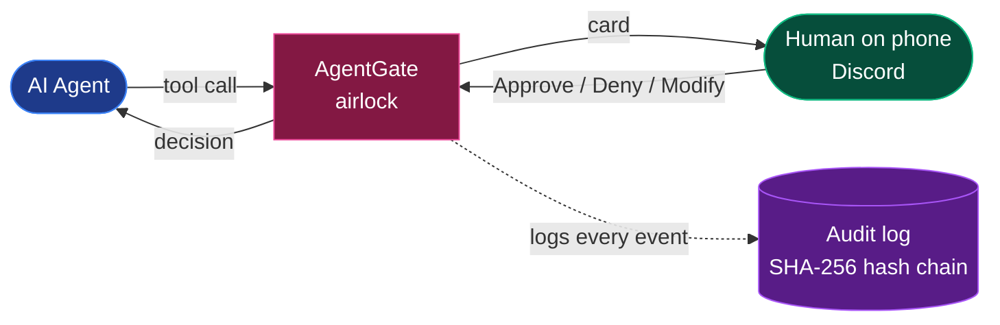
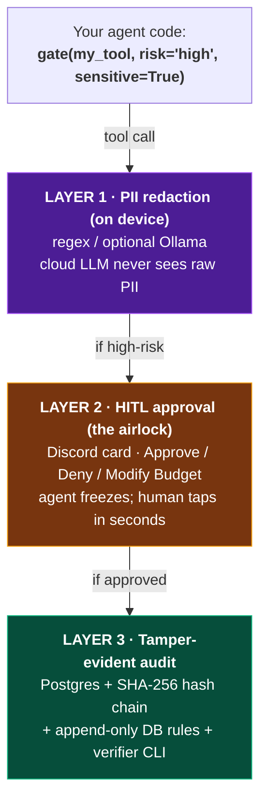
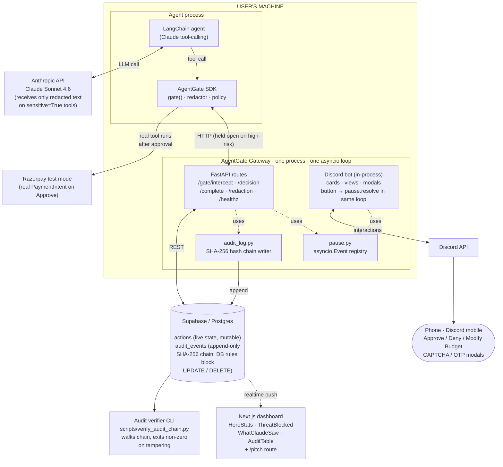
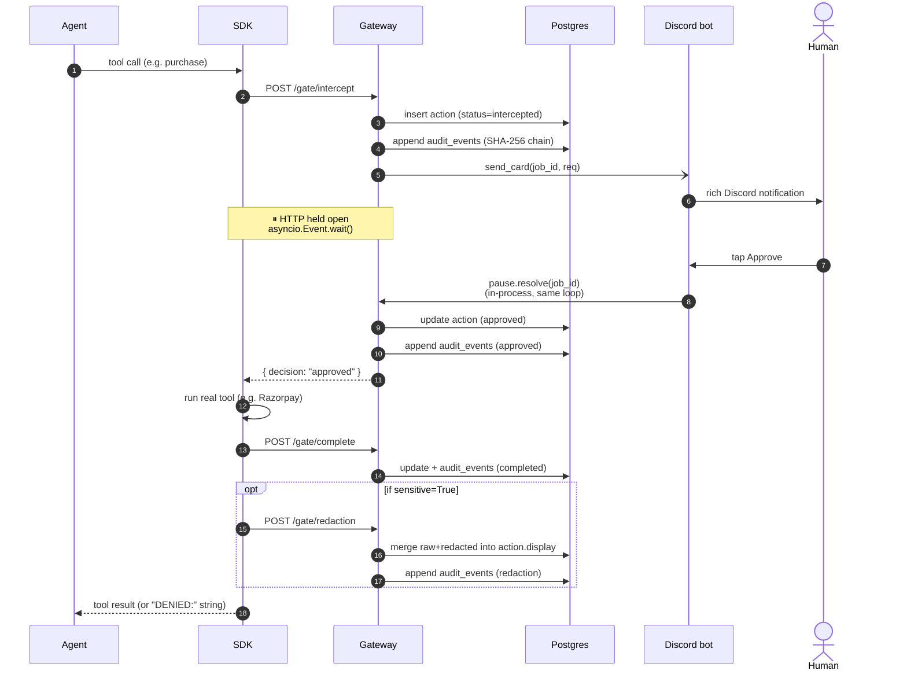

# AgentGate — Architecture

Four views at increasing zoom — the napkin, the three trust layers, the
system map, and the lifecycle of one high-risk call. All diagrams are
Mermaid, so they render natively on GitHub, in Notion / Obsidian, and via
[mermaid.live](https://mermaid.live) for SVG/PNG export.

---

## 1. The napkin (pitch view)

Agent runs autonomously for safe stuff. At any risky action, AgentGate
freezes it. Human gets a Discord card. One tap to approve / deny /
modify. Resume. Everything ends up in a tamper-evident audit log.

---

## 2. The three trust layers

Each layer is opt-in per tool. `risk="low"` skips layer 2. Omitting
`sensitive=True` skips layer 1. Layer 3 is automatic for everything that
touches the gateway.

---

## 3. The system map

**The architectural choice worth memorizing:** the Discord bot runs inside
the FastAPI process, sharing one asyncio event loop. A Discord button
click calls `pause.resolve(job_id)` *directly* on the in-process Event the
HTTP request is awaiting. No webhook, no queue, no polling — just
`event.set()`. That's why resume feels instant on stage.

---

## 4. Lifecycle of one high-risk call

**For `sensitive=True` low-risk tools** (e.g. `verify_customer_identity`,
`read_transactions`), the lifecycle is shorter: gateway returns
`auto_approved` immediately, the SDK runs the real tool, the SDK pipes the
output through the local redactor, then posts the raw + redacted text to
`POST /gate/redaction` so the dashboard's `WhatClaudeSaw` panel can render
the proof.

**For `mode="input"` (CAPTCHA / OTP)**, the human's typed answer replaces
the tool's output — the human literally becomes a tool in the agent's
toolbox.

---

## Why this architecture, not the obvious alternatives

| Alternative we considered | Why we rejected it |
|---|---|
| Polling — agent re-queries gateway for status every 1 s | Slow resume (1 s p99 instead of instant); harder failure semantics; more chatty |
| Separate gateway + bot processes (gateway calls Discord webhook) | Inter-process hop adds latency; needs a queue to wake the held request; extra moving part |
| Webhook from Discord back to gateway | Requires the gateway to be publicly addressable from Discord's infra; adds HMAC/replay complications. We do support this path via `POST /gate/decision` for non-Discord callers (HMAC-SHA256 signed), but the in-process path is the default. |
| Redis pub/sub for the wake signal | More dependencies; in-process `asyncio.Event` is simpler and same-loop, so it's instant. Persistent pause state across restarts is a known gap (see roadmap). |
| LangGraph's `interrupt` primitive | Couples your agent to LangGraph. AgentGate is framework-agnostic — same SDK works with raw LangChain, CrewAI, OpenAI Agents SDK, or any tool-calling abstraction. |
| Mutable single audit table | Database admin could silently rewrite history. We use a hash-chained `audit_events` table with DB-level rules blocking UPDATE/DELETE and a verifier that catches anyone who drops the rule. |
| Blockchain anchoring | Overkill for the realistic threat model (internal DB tampering). SHA-256 chain + append-only rules + verifier covers it. External transparency-log anchoring (Sigsum / Rekor) is on the roadmap. |

---

## Known gaps / roadmap

- **Persistent pause state.** `pause._events` is in-process; a gateway restart
  loses every frozen agent. Fix is straightforward — back the registry with
  Redis or a Supabase poller — but not built yet.
- **External audit anchor.** The hash chain catches database tampering but
  the chain head is stored alongside the rest of the chain. Periodic
  publication to an external transparency log (Sigsum, Rekor, S3 with
  object lock, or a git repo) would close the "admin rewrites the entire
  chain from event 1" attack. Roadmap.
- **Multi-stakeholder approvals.** Real enterprise actions sometimes need
  `all_of: [CTO, Finance]` or `quorum: 2 of [security-team]`. Today it's
  single-approver; the data model already supports a list, the UI doesn't yet.
- **Multi-channel.** Discord today. Slack / Teams / Telegram are all one
  adapter file away.
- **Pluggable audit sinks.** Today it's Supabase. Compliance teams want it
  in Datadog / Splunk / Honeycomb. Same protocol, different writer.
- **The `gate://` protocol.** A 1-page spec would let any agent framework
  implement to it. (Anthropic's MCP is the closest analog of doing this
  for a different concern.)
- **Stronger redaction.** Regex catches the standard PII shapes; Ollama
  catches more semantically (street addresses, narrative-form identity).
  For HIPAA you'd want Microsoft Presidio or a NER model.
