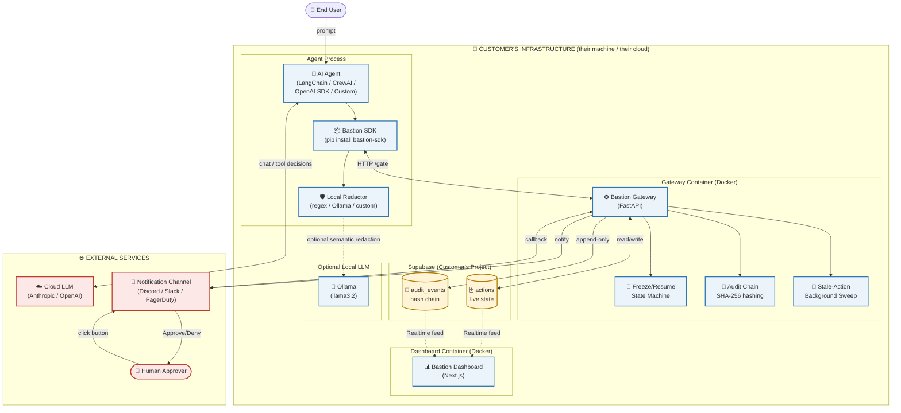
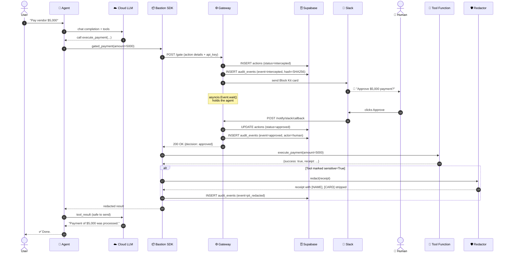
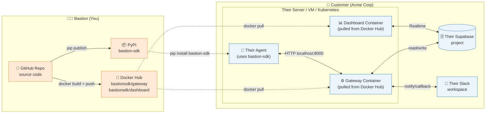

# Bastion SDK — Architecture Diagrams

This document contains four views of the architecture:
1. **High-Level System Diagram** — components and boundaries
2. **Detailed Request Flow** — sequence of every step a gated action goes through
3. **Deployment Diagram** — what runs where (you vs. the customer)
4. **Trust Boundary Map** — what crosses the perimeter, what never does

---

## 1. High-Level System Diagram



---

## 2. Detailed Request Flow

Step-by-step view of what happens when an agent calls a high-risk tool.



---

## 3. Deployment Diagram

Where each piece lives and how it gets there.



---

## 4. ASCII Version (Terminal-Friendly)

For viewing without a Mermaid renderer.

```
╔════════════════════════════════════════════════════════════════════════════╗
║                       CUSTOMER'S INFRASTRUCTURE                            ║
║                                                                            ║
║   ┌──────────────────────────────────────────────────────────────────┐    ║
║   │                       AGENT PROCESS                              │    ║
║   │                                                                  │    ║
║   │   User Prompt                                                    │    ║
║   │       ↓                                                          │    ║
║   │   ┌──────────────┐    chat     ┌────────────────────┐            │    ║
║   │   │  AI Agent    │ ←─────────→ │  Cloud LLM         │            │    ║
║   │   │  (LangChain) │             │  (Anthropic/OpenAI)│            │    ║
║   │   └──────┬───────┘             └────────────────────┘            │    ║
║   │          │ tool call                                              │    ║
║   │          ↓                                                        │    ║
║   │   ┌──────────────┐   ┌─────────────┐                              │    ║
║   │   │ Bastion SDK  │ → │  Redactor   │ → Ollama (optional)          │    ║
║   │   │   gate(fn)   │   │ regex/llama │                              │    ║
║   │   └──────┬───────┘   └─────────────┘                              │    ║
║   │          │                                                        │    ║
║   └──────────┼────────────────────────────────────────────────────────┘    ║
║              │ HTTP POST /gate (api_key)                                  ║
║              ↓                                                            ║
║   ┌──────────────────────────────────────────────────────────────────┐    ║
║   │                  GATEWAY CONTAINER (Docker)                      │    ║
║   │                                                                  │    ║
║   │   ┌──────────────────────────────────────────────────┐           │    ║
║   │   │            Bastion Gateway (FastAPI)             │           │    ║
║   │   │  ┌───────────┐  ┌───────────┐  ┌─────────────┐   │           │    ║
║   │   │  │ Freeze /  │  │  Audit    │  │ Stale Action│   │           │    ║
║   │   │  │  Resume   │  │  Chain    │  │  Sweeper    │   │           │    ║
║   │   │  │  Machine  │  │ (SHA-256) │  │ (every 60s) │   │           │    ║
║   │   │  └───────────┘  └───────────┘  └─────────────┘   │           │    ║
║   │   └─────┬────────────────┬─────────────────┬─────────┘           │    ║
║   │         │ write          │ append          │ notify              │    ║
║   │         ↓                ↓                 ↓                     │    ║
║   │   ┌───────────────────────────┐    ┌──────────────────┐          │    ║
║   │   │   SUPABASE (their DB)     │    │  Notifier        │          │    ║
║   │   │ ┌──────────┐ ┌──────────┐ │    │  Discord/Slack/  │          │    ║
║   │   │ │ actions  │ │ audit_   │ │    │  PagerDuty/Email │          │    ║
║   │   │ │ (state)  │ │ events   │ │    └────────┬─────────┘          │    ║
║   │   │ │          │ │ (chain)  │ │             │                    │    ║
║   │   │ └─────┬────┘ └────┬─────┘ │             ↓                    │    ║
║   │   └───────┼───────────┼───────┘    ┌──────────────────┐          │    ║
║   │           │ Realtime  │            │  Human Approver  │          │    ║
║   │           ↓           ↓            └────────┬─────────┘          │    ║
║   │   ┌──────────────────────────┐              │ click Approve      │    ║
║   │   │   DASHBOARD (Next.js)    │ ←────────────┘                    │    ║
║   │   │ HeroStats · AuditTable   │                                   │    ║
║   │   │ ActionDrawer · Actors    │                                   │    ║
║   │   │ ChainIntegrityBadge      │                                   │    ║
║   │   └──────────────────────────┘                                   │    ║
║   │                                                                  │    ║
║   └──────────────────────────────────────────────────────────────────┘    ║
║                                                                           ║
╚═══════════════════════════════════════════════════════════════════════════╝
```

---

## 5. Component Responsibility Matrix

| Component | Lives In | Responsibility | Talks To |
|---|---|---|---|
| **AI Agent** | Customer's app | Decides what tools to call | LLM, Bastion SDK |
| **Bastion SDK** | Customer's app (pip) | Intercepts tool calls, redacts PII | Gateway, Redactor |
| **Redactor** | Customer's app | Strips PII from tool output | Ollama (optional) |
| **Gateway** | Customer's Docker | Freeze/resume, audit chain, decisions | Supabase, Notifier |
| **Audit Chain** | Inside Gateway | SHA-256 chains every event | Supabase only |
| **Stale Sweeper** | Inside Gateway | Auto-denies orphaned frozen actions | Supabase only |
| **Notifier** | Inside Gateway | Sends approval requests | Slack/Discord/etc. |
| **Supabase** | Customer's cloud | Stores actions + audit events | Dashboard (Realtime) |
| **Dashboard** | Customer's Docker | Live UI for approvals + audit | Supabase Realtime |
| **Ollama** | Customer's machine | Optional semantic PII redactor | SDK Redactor only |

---

## 6. Trust Boundary Map

What crosses the network perimeter — and what never does.

```
┌────────────────────────────────────────────────────────────────────────┐
│                  CUSTOMER'S TRUST PERIMETER                            │
│                  (their VPC / their machine)                           │
│                                                                        │
│    ✅ Raw PII (names, cards, OTPs)                                     │
│    ✅ Audit chain hashes                                               │
│    ✅ Tool arguments and results                                       │
│    ✅ API keys (their own)                                             │
│    ✅ All Supabase data                                                │
│                                                                        │
│                                                                        │
│      ↕   Redacted text only                                            │
│      ↕   (no raw PII)                                                  │
│      ↕                                                                 │
└──────╫─────────────────────────────────────────────────────────────────┘
       ║
       ╠═══════════════════════════════════════════════════════════════
       ║
   ┌───v────────────────────────────────────────────────────────────┐
   │                        EXTERNAL                                 │
   │                                                                 │
   │   ☁️ Cloud LLM (Anthropic/OpenAI)                              │
   │      → Sees: redacted tool results, agent messages              │
   │      → Never sees: raw PII, audit chain                         │
   │                                                                 │
   │   💬 Notification Channel (Slack/Discord)                       │
   │      → Sees: tool name, risk level, summary                     │
   │      → Configurable: hide args, show args, redact args          │
   │                                                                 │
   │   🐳 Docker Hub / 📦 PyPI                                      │
   │      → Only delivers Bastion code TO customer                   │
   │      → Never receives data FROM customer                        │
   │                                                                 │
   └─────────────────────────────────────────────────────────────────┘
```

---

## 7. The Three-Layer Trust Model

```
        ┌─────────────────────────────────────────────────────────┐
        │  LAYER 3 — FORENSIC AUDIT                               │
        │  Every decision logged. Hash-chained. Tamper-evident.   │
        │  Owner: Legal / Compliance                              │
        ├─────────────────────────────────────────────────────────┤
        │  LAYER 2 — HUMAN-IN-THE-LOOP                            │
        │  High-risk actions freeze. Human approves or denies.    │
        │  Owner: Operations / Security                           │
        ├─────────────────────────────────────────────────────────┤
        │  LAYER 1 — PII FIREWALL                                 │
        │  Sensitive data redacted locally before cloud LLM call. │
        │  Owner: Privacy / Data Protection                       │
        ├─────────────────────────────────────────────────────────┤
        │                                                         │
        │            🤖  AGENT'S TOOL CALLS                       │
        │            (every call passes through all 3 layers)     │
        │                                                         │
        └─────────────────────────────────────────────────────────┘
```
